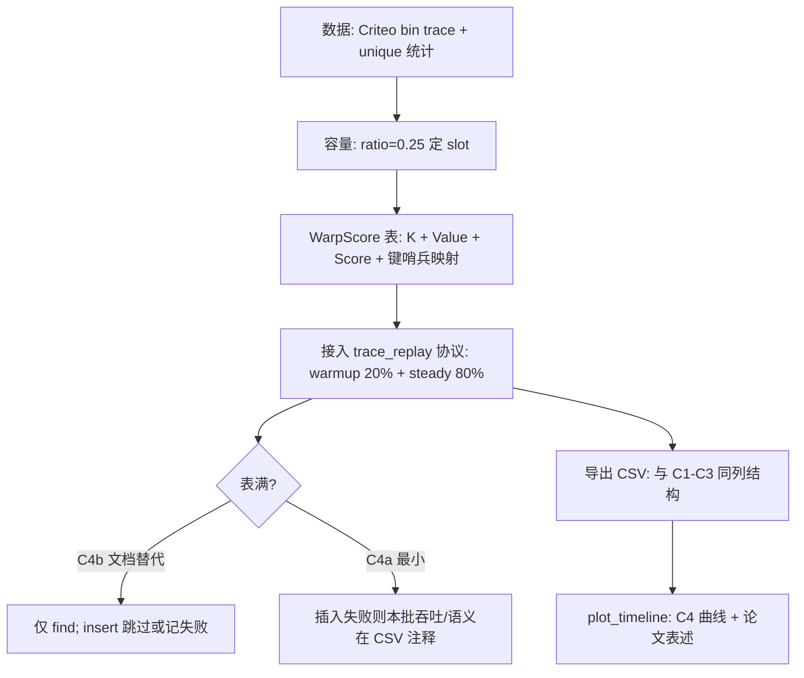

# WarpScore 实验待办清单（对齐 `experiment.md`）

> **说明**：`experiment.md` 正文使用 **C4 / WarpCore** 表述，未出现「WarpScore」一词。本文件将 **WarpScore** 定义为仓库内对 **C4（WarpCore，字典语义、无驱逐）** 的可测实现代号，并在实现层显式维护 **(value, score)**，其中 **score 在 GPU kernel 内通过 `%globaltimer`（与 Merlin `device_nano()` 同源语义）在每次访问路径上更新**，以便与论文中 **score-driven eviction / LRU 时间戳** 叙事一致，且满足「真实表无 export API」时仍可在设备侧保留 **可观测的最近访问时间**。

---

## 1. 与 `experiment.md` 的条款映射

| `experiment.md` 位置 | 对 WarpScore / C4 的要求 |
| -------------------- | ------------------------ |
| §2 | 字典语义表 **零驱逐**；满则 **插入失败** 或进入只读；**不得**假装有 Merlin 式 `export_batch → sort → erase`（除非明确标为另一配置，而非 C4）。 |
| §4 Exp #5 协议 | Phase 1：前 **20%** trace 访问；Phase 2：余下 **80%**；每批 **find → insert_or_assign**；记录吞吐、命中率、负载因子、（C4 无 baseline stall）stall 恒为 0。 |
| §4「Alternative baseline」 | C4 可选语义：表满后 **停止 insert，仅 continue find**，突出与 HKV 差距；待办中列为 **C4a/C4b** 两档，跑数时在元数据中写清。 |
| 配置表 C4 | **WarpCore (dict, no evict)**，`capacity ratio = 0.25`，数据集 **Criteo 7-day**，目的 **Fails at capacity**（或只读 find 的极端曲线）。 |
| §5.3 `trace_replay_benchmark` | 二进制 trace、`dim=32`、`batch_size=1M`、墙钟含 **GPU sync**；CSV 列与现有 C1–C3 **可比**（同列语义）。 |
| §7 | H100 NVL、Config B（dim=32,batch=1M）、计时含墙钟、trace `uint64` 小端顺序；C4 **不**要求与 Merlin baseline 共用 export API。 |

---

## 2. 逻辑总览（执行顺序）

---

## 3. 待办列表（按阶段）

### 阶段 0 — 范围与可复现性（§7、§3）

- [ ] **0.1** 固定实验环境说明：GPU 型号、CUDA 版本、WarpCore 依赖版本/commit（写入 `run_meta.json` 或等价侧车文件）。
- [ ] **0.2** 确认 HKV 论文引用 commit 与 `experiment.md` 一致或记录偏差及原因。
- [ ] **0.3** 从预处理结果读取 **unique_keys**，按 §3 计算 `table_capacity = floor(ratio * unique_keys)`，**C4 使用 ratio=0.25**。

### 阶段 1 — Trace 与统计（§3、§5.1、§5.2）

- [ ] **1.1** 使用已脚本化流程生成 **7-day** `uint64` 小端 trace（或与现有 `day_*.bin` 拼接一致）。
- [ ] **1.2** 运行 trace 统计（总量、unique、估计 α）；将结果写入实验元数据，满足 §7「报告实测 α」。
- [ ] **1.3** 验证 `trace_replay_benchmark` 能 **mmap 多文件顺序拼接**（与当前实现一致）。

### 阶段 2 — WarpScore 核心实现（§2 字典语义 + 用户定义 WarpScore）

- [ ] **2.1** 选定设备侧条目布局：**每槽 (embedding + score)**；`embedding` 与 §7 `dim=32` 对齐；`score` 为 `uint64`（或与 Merlin LRU 对齐的纳秒时间戳）。
- [ ] **2.2** 在 **find / insert_or_assign 对应的 device 路径**（或紧耦合的融合 kernel）内，对 **被访问到的槽** 写入 score：使用 **`%globaltimer`**（项目内可对齐 `nv::merlin::device_nano()` 封装），**禁止**仅用 host 时钟代替（与 §3.3 LRU 语义及前文设计一致）。
- [ ] **2.3** 处理 WarpCore **保留键**（如 `key==0`、`key==~0ULL`）：对 trace 中的 `uint64` 做 **可复现映射**，全 trace 一致。
- [ ] **2.4** 实现 **find**：输出命中掩码 + 命中行 embedding；miss 行为与当前 Merlin trace 路径一致（便于命中率对齐）。
- [ ] **2.5** 实现 **insert_or_assign**：在容量未满时为 upsert；**满表策略**二选一并在跑数配置中固定：
  - **C4a**：插入失败计数/标记，批次仍计 wall-clock（用于「Fails at capacity」）；
  - **C4b**（§4 Alternative）：满后 **不再 insert，仅 find**，直至 trace 结束。
- [ ] **2.6** **不提供**也不模拟依赖 Merlin 的 **export_batch → CPU sort → erase** 作为 C4 的一部分（避免与 §2「无驱逐 API」矛盾）；若需对比锯齿 baseline，仍使用 **C3** 配置，而非 C4。

### 阶段 3 — 接入 `trace_replay_benchmark` 协议（§4、§5.3）

- [ ] **3.1** 增加运行模式开关（例如 `--mode warpscore` 或 `--engine warpcore`），与现有 `cache` / `baseline` 互斥或组合规则写清。
- [ ] **3.2** **Phase 1**：`warmup_fraction=0.2`，每批 `find → insert_or_assign`，统计 batch hit rate（与现 CSV 一致）。
- [ ] **3.3** **Phase 2**：余下 80%，同样每批 `find → insert_or_assign`；**C4 无 eviction stall**：`stall_occurred=0`，`stall_duration_ms=0`。
- [ ] **3.4** 吞吐列语义与现实现一致：**每批 2×batch 次 KV 类操作**（find + insert_or_assign）除以墙钟毫秒，输出 **B-KV/s**（与 `trace_replay_benchmark.cc.cu` 一致）。
- [ ] **3.5** `load_factor`：在 WarpCore 语义下定义为 **已占用槽 / table_capacity**（或库提供的等价量），并在表满后 plateau。
- [ ] **3.6** `cumulative_hit_rate` 仅在 **steady** 阶段累计，与现有 CSV 列兼容。

### 阶段 4 — C4 跑数与产物（配置表、§6）

- [ ] **4.1** 使用 **Criteo 7-day** trace、**capacity ratio 0.25** 跑通 **C4** 至少一种满表策略（C4a 或 C4b），产出与 C1–C3 **同列 CSV**。
- [ ] **4.2** 在 `run_meta.json`（或脚本参数）中标注：`config=C4`、`engine=WarpScore`、`full_policy=C4a|C4b`、`table_capacity`、`unique_keys`、`alpha`。
- [ ] **4.3** 生成时间线数据供 `plot_timeline`：预期 C4 在满表后吞吐/命中率出现 **与 HKV 不同的平台期或下跌**（与 §6 叙述一致，具体形状依赖 C4a/C4b）。
- [ ] **4.4** 论文/附录一句话：**C4 无周期性 stall**，与 C3 的 **sawtooth stall** 对照维度不同（避免读者混淆两种 baseline）。

### 阶段 5 — 验证与论文绑定（§6、§11）

- [ ] **5.1** 用小 trace（如 `--max-keys`）做正确性对照：键映射、命中率边界、满表后行为。
- [ ] **5.2** 核对 CSV 列名与 `experiment.md` §5.3 草图及现有 `trace_replay_results.csv` 一致。
- [ ] **5.3** 撰写 Exp #5 段落中 **C4 一句角色**：字典语义真实实现 vs C3 模拟 stop-the-world 的互补关系（见 §4 Alternative baseline）。

---

## 4. 验收检查（WarpScore / C4）

1. **协议**：严格 **20% / 80%** 两阶段；每批 **find → insert_or_assign**。
2. **约束**：**dim=32**，**batch_size=1M**（§7）；计时含 **cuda sync**。
3. **语义**：**无**周期性 export-sort-evict；stall 列对 C4 为 **0**。
4. **Score**：设备侧更新路径使用 **`%globaltimer`**（或与 `device_nano()` 等价封装），与 host 填常数区分。
5. **可复现**：trace 路径、capacity 公式、`C4a/C4b` 策略、依赖版本可查。

---

## 5. 显式非目标（避免范围漂移）

- 不在 C4 内实现 **LFU**（配置表 C4 为 **N/A** policy）。
- 不把 **C3（HKV degraded + periodic evict）** 的 stall 行为强加到 WarpCore 路径上冒充 C4。
- 不将 **WarpScore** 的 score 用于「无 API情况下的真实全表 export」除非后续单独开题并改 `experiment.md`。

---

*本清单随 `experiment.md` 修订而更新；若正文将 C4 正式改名为 WarpScore，请同步替换 §1 术语说明。*
